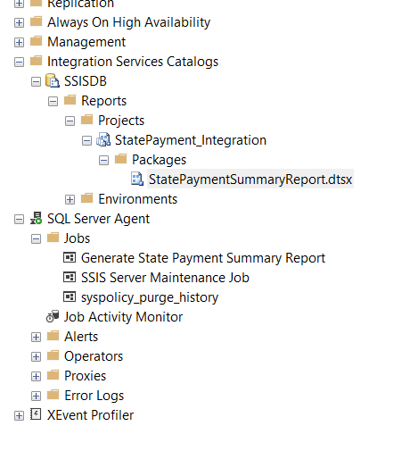

# SSIS Learning Series – State Payment Summary Automation

## Overview

Welcome to **Project 1** of my SSIS Learning Series! This foundational project focuses on automating the extraction, transformation, and reporting of state payment data using SSIS. It’s the first step in my journey to master SSIS package building and debugging.

### Project Objective:
Automate the extraction of payment data from a CSV file, perform necessary transformations, and generate a report summarizing the number of payments less than or equal to the national average for each state.

## Key Features & Techniques:

### ✔️ Data Extraction:
- **CSV file** is used as the data source, where daily payment records are extracted.
  
### ✔️ Data Transformations:
- **Derived Columns**: Created new calculated fields based on the raw data.
- **Aggregation**: Counted payments less than or equal to the national payment amount, grouped by state.

### ✔️ Dynamic File Handling:
- **DatePart Variable**: Dynamically updated file names with the current date, ensuring the package processes the correct files automatically each day.

### ✔️ End-to-End Automation:
- Set up a **SQL Server Agent Job** to execute the SSIS package daily at 9 AM. This automated the ETL and reporting workflow, providing fresh insights every morning.

## Screenshots and Diagrams




## Files:
- **SSIS_Package**: Contains the SSIS package file (`.dtsx`) for automating state payment data processing.
- **Data**: Includes the sample CSV file with payment data for testing the SSIS package.
- **Logs**: (If available) Contains log files for SSIS package execution.

## Key Takeaways:
This project helped me get hands-on experience with:
- Using **SSIS Variables and Expressions**.
- Applying **data flow transformations** such as **Derived Column** and **Aggregation**.
- Automating the ETL process with **SQL Server Agent Jobs**.
- Implementing **dynamic file handling** in SSIS packages.

## Future Work:
- **Complex Data Transformation**: In Project 2, I’ll work on implementing more advanced transformations like Slowly Changing Dimensions (SCDs) and incremental load.
- **Error Handling**: Adding more robust error handling and logging mechanisms in future SSIS projects.

## How to Run the Project:
1. **Download the project** by cloning this repository:
   ```bash
   git clone https://github.com/your-username/SSIS-State-Payment-Summary-Automation.git
